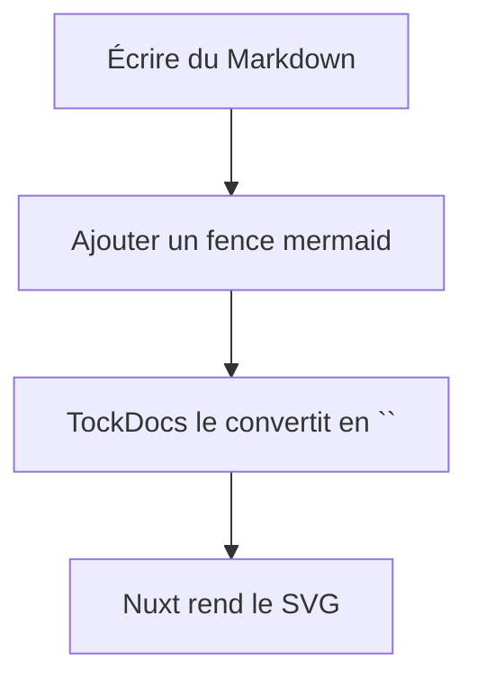
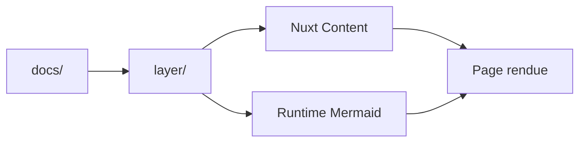
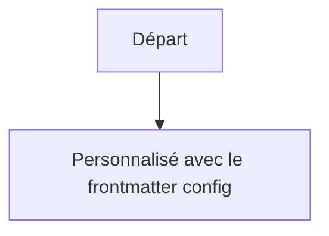

## Mermaid est déjà activé

TockDocs enregistre `@barzhsieh/nuxt-content-mermaid` dans la couche partagée, donc toute page Markdown sous `docs/content/**` peut rendre des fences Mermaid.

Vous n’avez **pas** besoin d’ajouter un composant Vue séparé pour le cas courant. Il suffit d’écrire un fence Mermaid au niveau racine du fichier Markdown, et la couche le transformera en diagramme réactif.

## Créer votre premier diagramme



## Construire des diagrammes adaptés à TockDocs

Un exemple simple pour TockDocs :



Vous pouvez aussi utiliser des diagrammes de séquence, d’état, de classes, et plus encore — tout ce que Mermaid prend en charge.

## Personnaliser un diagramme par page

TockDocs expose un champ de frontmatter `config` pour les surcharges Mermaid. La couche partage déjà ce champ dans `layer/content.config.ts`, donc il est bien parsé comme un objet.

```md
---
title: Diagrammes Mermaid
config:
  theme: forest
  flowchart:
    curve: step
---
```



## Conseils utiles

- Gardez exactement le nom de fence `mermaid`
- Placez le fence au niveau racine du fichier Markdown
- Utilisez une syntaxe Mermaid valide ; une simple faute de frappe peut déclencher `⚠️ Mermaid Diagram Error`
- Si vous changez la configuration du module, redémarrez le serveur de développement pour que Vite puisse ré-optimiser les dépendances

## Quand l’utiliser

Utilisez Mermaid pour expliquer :

- la structure du workspace
- les flux de requêtes ou de données
- les décisions d’architecture
- les étapes d’onboarding
- les chemins de déploiement
